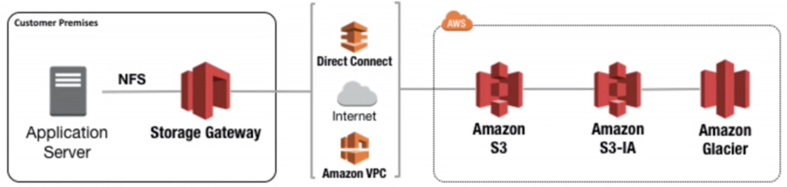
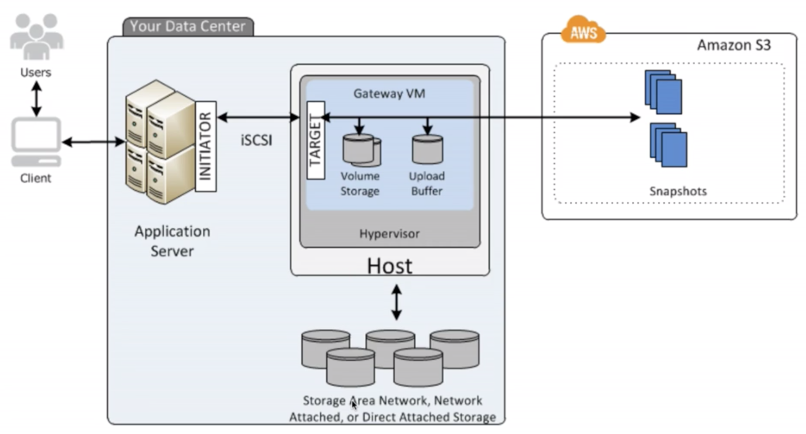
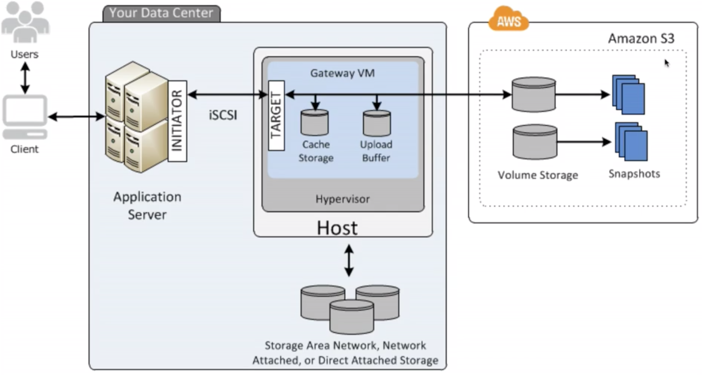
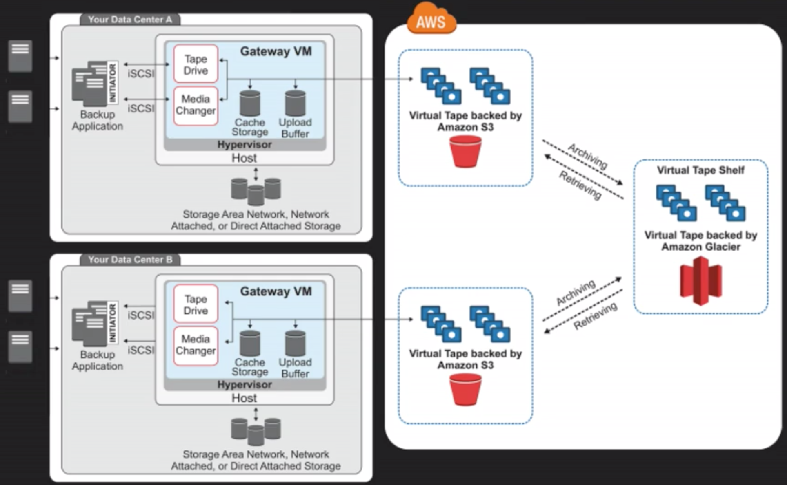

# Storage Gateway

## General

- Conecta aparatos on-premise con almacenamiento en la nube
- Disponible para descargar como una VM
- 4 tipos
	- File Gateway (NFS): almacena archivos planos en S3
	- Volume Gateway (iSCSI): almacenamiento en bloque, tiene 3 subtipos:
		- Stored Volumes: se almacena una copia completa on-premise, antes llamado Gateway Stored Volume
		- Cached Volumes: solo se almacena la data accedida más recientemente on-premise, el resto está respaldada en la nube, antes llamado Gateway Cached Volume
		- Tape Gateway (VTL): solución de backup y archivado, almacenado en S3, antes llamado Gateway Virtualtape Library

## File Gateway

- Archivos se guardan en S3 buckets
- Basado en bloques
- Se accede a través de Network File System
- Permisos, timetamps y propiedad son guardados en metadata de los objetos
- Una vez almacenados en S3, pueden ser administrados como objetos nativos de S3, utilizando lifecycle, policies, versionamiento, etc
- Se puede conectar por internet, Direct Connect o VPC

## Volume Gateway

- Presenta volúmenes de disco a las aplicaciones usando el protocolo de bloques iSCSI
- Data escrita a estos volúmenes puede ser respaldada en forma asíncrona como snapshots, los cuales son guardados en la nube como snapshots de EBS
- Snapshots son respaldos incrementales y comprimidos, lo que minimiza el costo de almacenamiento

### Stored Volumes

- La data se almacena localmente, mientras es respaldada en la nube en forma asíncrona
- Este método entrega acceso con baja latencia a toda la data, ya que todo está on-premise, y respaldos durables y separados físicamente
- Tamaño desde 1 GB a 16 TB

### Cached Volumes

- La data se almacena en S3, y data accedida frecuentemente se mantiene en el caché del storage gateway local
- Tamaño hasta 32 TB

### Tape Gateway

- Permite aprovechar solución existente basada en cintas para almacenar data en cintas virtuales que se crean en el tape gateway. 
- Soportedo por aplicacinoes de respaldo como NetBackup, Backup Exec, Veeam, etc

