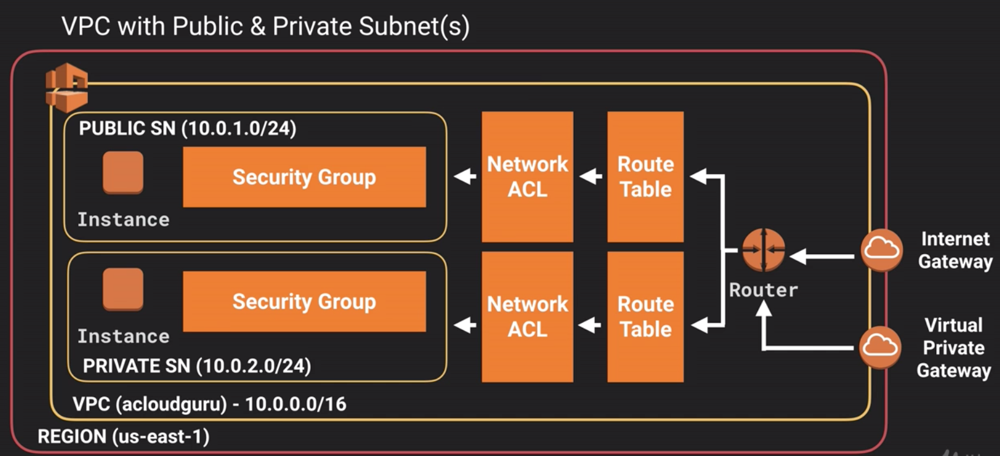
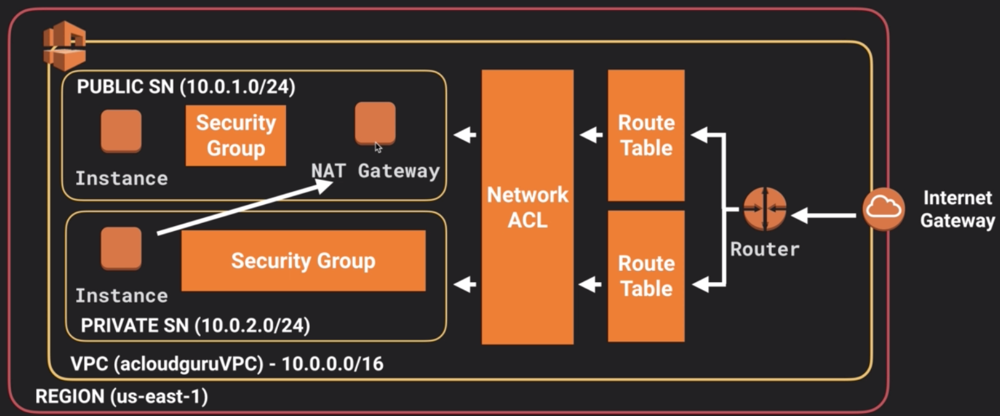

# VPC

- Es un datacenter virtual en la nube
- Cada cuenta nueva tiene un VPC por defecto armado por AWS
- Permite provisionar una seccion lógicamente aislada de AWS, con total control sobre los rangos de IP, subnets, tablas de rutas y network gateways
- Se puede crear un Hardware VPN para conectar el VPC con el datacenter on-premise de la empresa
- Límite por defecto de 5 VPCs por región
- Se debe establecer un rango de IPs en forma de bloques CIDR:
	- Mínimo: `/16` (65536 IPs)
	- Máximo: `/28` (16 IPs)
- Rangos de subnets deben ser igual o menores que el de VPC
- Rangos de subnets no pueden intersectar
- Máximo 1 Internet Gateway por VPC, el cual debe ser creado y adjuntado
- Una subnet puede pertenecer solo a una AZ
- Una AZ puede tener más de una subnet
- En el Default VPC todas las subnets tienen ruta hacia internet, y no hay subnets privadas
- En el Default VPC, todas las instancias EC2 tienen IP privada y pública
- Si se crea un VPC con Dedicated Tenancy, todas las instancias dentro de este serán dedicadas también
- Puede habilitarse bloque CIDR IPv6
- En una subnet, AWS se reserva el uso de 5 IPs:
	- `10.0.0.0`: Network Address
	- `10.0.0.1`: Reservada para el router
	- `10.0.0.2`: IP del servidor DNS
	- `10.0.0.3`: Reservada para uso futuro
	- `10.0.0.255`: Network Broadcast Address

## Security Groups

- Son stateful, es decir, si se permite un protocolo entrante, automáticamente será permitido saliente
- Actúa al nivel de instancia
- Todo el tráfico entrante está bloqueado por defecto, excepto SSH (`22`) para Unix y RDP (`3389`) para Windows
- Todo el tráfico está permitido por defecto
- Modificaciones son aplicadas inmediatamente
- No se pueden agregar reglas para denegar acceso, solo para permitir
- Se puede tener cualquier número de instancias en un grupo
- Pueden cubrir más de una AZ
- Solo pueden pertenecer a un VPC

## Network Access Control Lists

- Son una lista enumerada de reglas
- Las reglas se aplican en orden númerico, con las menores siendo apicadas primero
- Actúa como un firewall básico
- Actúa al nivel de subnet
- Pueden cubrir distintas AZs
- Vienen antes que los Security Groups
- A diferencia de los SG, permiten bloquear IPs
- Son stateless, es decir, respuestas de tráfico entrante están sujetas a reglas en tráfico saliente y viceversa
- Se recomienda hacer las reglas de 100 en 100 para después poder añadir reglas específicas que alteren el funcionamiento
- Solo se puede tener un NACL por subnet, pero varios subnets pueden tener el mismo NACL
- Si no se asocia explícitamente una subnet a un NACL, automáticamente se asociará al por defecto
- Cuando se asocia un NACL a una subnet, la asociación anterior de la subnet es eliminada
- Solo se pueden asociar a un VPC
- En el VPC creado por AWS, el NACL permite todo el tráfico de entrada y salida
- En un VPC nuevo, el NACL por defecto rechaza todo el tráfico de entrada y salida
- Para permitir conexión con clientes a través de internet, se debe poner una regla de salida para los [puertos efímeros](https://en.wikipedia.org/wiki/Ephemeral_port)

## Route Tables

- Se crea una automáticamente al crear un VPC, que es definida como principal
- Por defecto, todas las subnets creadas se asocian implícitamente a la tabla de rutas principal
- Idealmente, dejar la tabla de rutas principal sin ruta hacia el IG, y crear una nueva con ruta hacia el IG, así las subnets nuevas por defecto son privadas

## Network Address Translation

- Se utiliza para dar acceso a internet a subnets privadas, para poder realiar updates e instalaciones de software
- Debe estar en una subnet pública
- Debe haber una ruta desde la subnet privada hacia la instancia

### NAT Instance

- Son instancias EC2 basadas en una NAT AMI
- La cantidad de tráfico que soportan depende del tipo de instancia
- Para que funcionen se debe desactivar el `Source/Destination Check` en la instancia
- Debe estar detrás de un Security Group
- Es necesario crear regla en SG que permita HTTP/HTTPS desde/hacia internet
- Son cuello de botella ya que no son manejadas por AWS, uno debe preocuparse de escalarlas, failovers, etc

### NAT Gateways

- Escala automáticamente hasta 10 Gbps
- AWS la maneja, por lo que no es necesario parcharla, actualizarla, etc
- Automáticamente asociada a un SG
- Automáticamente se le asigna una IP pública
- Idealmente tener una en cada AZ para mejorar redundancia
- No es necesario desactivar el `Source/Destination Check`
- Son más seguras que una instancia NAT, y por lo tanto más recomendables

## VPC Peering

- Permite conectar un VPC con otro directamente usando IPs privadas
- Instancias se comportan como si estuvieran en la misma red privada
- Se puede hacer peering con VPCs en otras cuentas AWS
- No es posible hacer transitive peering (si VPC A está conectado con VPC B, y VPC B está conectado con VPC C, VPC C no puede conectarse con VPC C)
- Los distintos VPCs no pueden tener bloques CIDR que intersecten
- Los pares pueden estar en distintas regiones

## Flow Logs

- Permiten capturar tráfico de IPs desde y hacia las interfaces de red en un VPC
- Logs son almacenados en CloudWatch
- Pueden ser creados a nivel VPC, subnet o interfaz de red
- Se puede loggear el tráfico aceptado, denegado, o ambos
- Requieren un Role y un Log Group en CloudWatch
- Pueden ser enviados a Lambda o Elasticsearch
- Pueden ser exportados a S3
- Una vez creados, no pueden ser modificados
- No se puede activar para VPCs que esten pareados con el VPC de la cuenta a menos que el par esté en la cuenta también
- No pueden tener tags
- Tráfico no monitoreado:
	- Tráfico generado por instancias al contactar servidor de DNS de AWS
	- Tráfico generado por Windows para activación de licencia
	- Tráfico DHCP
	- Tráfico a la IP reservada del VPC por defecto
	- Tráfico desde y hacia `169.254.169.254` (metadata de la instancia)

## Bastion Hosts

- Instancia EC2 en subnet pública que sirve para conectarse a instancias en subnets privadas desde fuera del VPC
- Generalmente se accede desde el bastion host a las instancias vía SSH o RDP
- También llamados *jumpboxes*
- En vez de tener todas las instancias públicas, se pueden tener todas sin conexión al exterior, y un solo bastion host bien fortalecido

## VPC Endpoints

- Permiten conectar recursos AWS entre ellos sin salir a internet
- Al usar el endpoint, la IP de origen utilizada es la IP privada, no pública
- Conexiones existentes en las subnets donde se activará el endpoint pueden ser botadas
- 2 tipos:
	- Gateways: no dependen de una Elastic Network Interface, lo que las hace mas fuertes
	- Interfaces: dependen de una ENI

## Pasos para crear un VPC

- Crear el VPC, indicando el bloque CIDR
- Automáticamente se crea una tabla de rutas, un NACL y un Security Group
- Crear subnets, indicando bloques CIDR que no se intersecten y que sean menores que el del VPC, y seleccionando la AZ
- Crear Internet Gateway y adjuntar al VPC
- Crear nueva tabla de rutas
- Añadir nueva ruta con destino `0.0.0.0/0` hacia el Internet Gateway, lo que permitirá salida a internet
- Para subnet públicas, encender "Auto-assign IPs" para que instancias asociadas tengan IPs públicas al momento de creación
- En el SG de la subnet privada, permitir acceso desde el SG de la subnet pública
- Para permitir capacidad de updates en subnet privada, crear una instancia NAT (o NAT Gateway) en la subnet pública
	- Para instancias NAT, se debe desactivar `Source/Destination Checks` en ala instancia
- Añadir una ruta en la tabla de rutas privada con destino `0.0.0.0/0` hacia la instancia NAT o NAT Gateway

